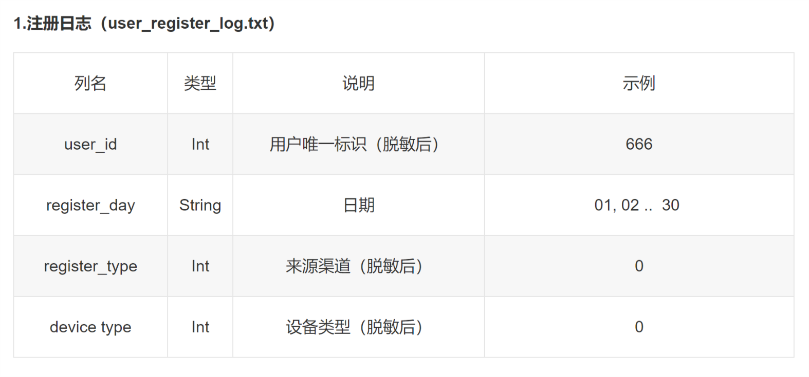
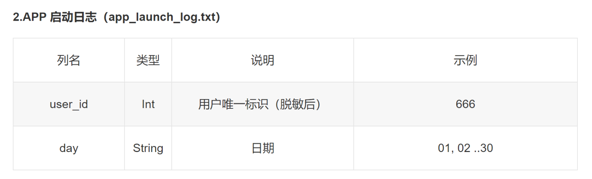
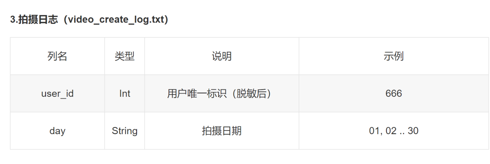
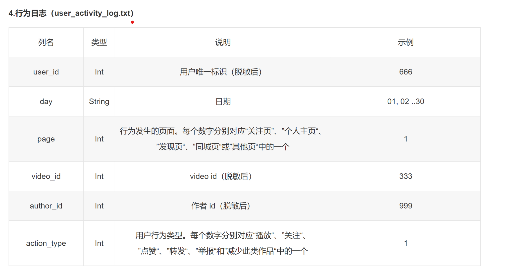

# 2018-KUAISHOU-BDC
[2018中国高校计算机大赛——大数据挑战赛](https://www.kesci.com/home/competition/5ab8c36a8643e33f5138cba4)

**初赛B top29, 复赛最终80, 第一次参赛经验有限, 能进入复赛也是运气挺好的, 没有在特征提取上进行更多的尝试, 模型的多样性和融合与大佬们差距巨大.  赛后开源是一个非常好多学习机会, 也算是收获.**

## 赛题理解
给出用户在快手APP上1-30日的历史行为，预测接下来7天(31-37)的活跃用户。活跃用户即在注册/启动/拍摄/活动任意log中出现的uid.

metrics: AUC

## 数据划分
1. data1：从1-16日数据提取用户及特征，17-23日提取标签
2. data2：从1-23日提取用户，8-23日提取特征，24-30日提取标签
3. data3：从1-30日提取用户，15-30日提取特征，预测31-37日是否活跃

滑窗法, 可以选择窗口size和滑窗stride, 一般是窗口size越大越好, stride小了很容易leak. 初赛尝试了不同的滑窗, 最终还是觉得baseline的效果比较好.

## 源数据

## 特征工程
    Baseline:
    注册信息
    APP 启动次数，平均次数，方差，启动天数，最大值，最小值，连续几天启动总次数，平均次数，某一天启动次数
    拍摄日志同上
    行为日志同上
    行为日志还可以对page和action_type提取一些分组统计特征
    对author_id分组提取信息作为（user_id==author_id)的特征

    具体:

    launch 特征: 
    1. 登陆天数的std, max, min, mean, count, 最近一次登陆时间差launch_day_gap.
    2. 每天的登陆统计, 加权的
    3. 记录连续登陆多少天

    register 特征:
    device_type, register_type one-hot编码

    video 特征: 
    1. 创建视频天数的std, max, min, mean, count, 最近一次创建视频时间差launch_day_gap.
    2. 每天的创建视频统计, 加权的
    3. 记录连续创建视频多少天

    activity 特征:
    1. act 时间的std, max, min, mean, count, 最近一次创建视频时间差launch_day_gap.
    2. 每天的act,统计, 加权
    3. page
    4. actype
    5. authorid

复赛阶段没有重建特征, 可能是上分困难的主要原因. 大佬们的手工特征都特别厉害, 特征真的是上限, 拼命调模型也没用.

## 模型
1. lgb
2. xgb
3. NN

最后一手NN算是hell Mary, 过拟合比较严重, 没有更多时间探索. 
主要是模型和特征不够多样, 融合效果也不好.

一定好好学习大佬们的开源, 和Kaggle上的kernels, 再接再厉.

## stars
1. [2018-KUAISHOU-TSINGHUA-Top13-Solutions](https://github.com/luoda888/2018-KUAISHOU-TSINGHUA-Top13-Solutions)
2. [蛇佬队友RNN](https://github.com/totoruo/KuaiShou2018-RANK13-RNN)
3. [好心的参赛选手收集的开源集合](https://github.com/linxid/Competition/tree/master/2018-%E5%BF%AB%E6%89%8B%E5%A4%A7%E6%95%B0%E6%8D%AE)
